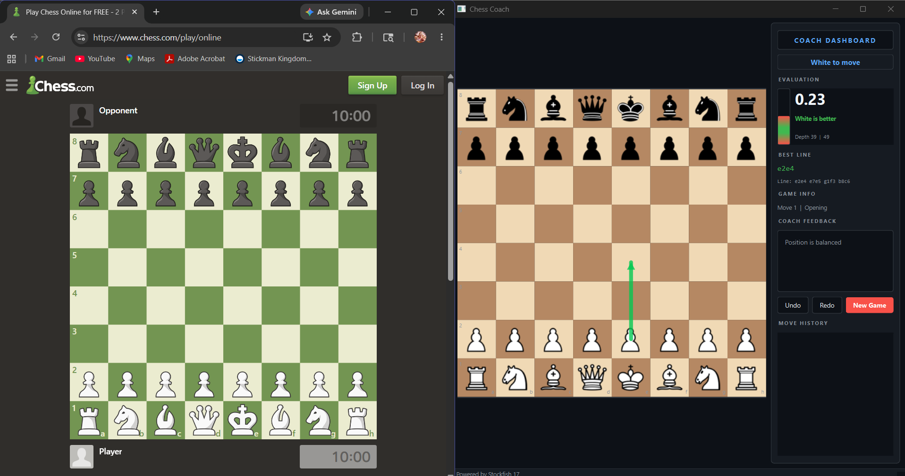

<div align="center">

# ♟️ Chess Coach

**Real-time position analysis engine · Desktop GUI & Web Interface**

[](https://python.org)
[](https://www.riverbankcomputing.com/software/pyqt/)
[](https://fastapi.tiangolo.com)
[](https://stockfishchess.org)
[](LICENSE)

[Features](#-features) · [Quick Start](#-quick-start) · [Usage](#-usage) · [Configuration](#%EF%B8%8F-configuration) · [Architecture](#-architecture) · [Tech Stack](#-tech-stack)

</div>

---

## 🎯 Overview

Chess Coach is a real-time chess analysis tool that integrates the **Stockfish 17** engine into a dual-interface application. It evaluates every position as you play, detects blunders, suggests best moves, and presents principal variation lines — all without interrupting your flow.

Choose your mode:

| Mode | Use Case |
|------|----------|
| **Desktop GUI** (PyQt6) | Full-featured analysis with eval bar, coach dashboard, and move history |
| **Web Interface** (FastAPI) | Lightweight browser-based access — play on your PC, view on your phone |

---

## ✨ Features

<table>
  <tr>
    <td>
      <h4>⚡ Real-time Evaluation</h4>
      Continuous Stockfish analysis updates eval, depth, and principal variation as you play.
    </td>
    <td>
      <h4>🚨 Blunder Detection</h4>
      Instantly flags moves that lose ≥1.0 pawns of advantage compared to the previous position.
    </td>
  </tr>
  <tr>
    <td>
      <h4>🎯 Best Move Suggestion</h4>
      Visual arrow overlay and UCI display showing the top engine line for the current position.
    </td>
    <td>
      <h4>🧑‍🤝‍🧑 Analysis Mode</h4>
      Play both sides freely — ideal for puzzle-solving, position study, or reviewing master games.
    </td>
  </tr>
  <tr>
    <td>
      <h4>📊 Coach Dashboard</h4>
      Eval bar, advantage label, engine depth, PV line, and natural-language feedback panel.
    </td>
    <td>
      <h4>↩️ Undo / Redo</h4>
      Full move-history navigation with Ctrl+Z / Ctrl+Y shortcuts on both desktop and web.
    </td>
  </tr>
  <tr>
    <td>
      <h4>🌐 LAN Multi-device</h4>
      Web server auto-detects your LAN IP — analyze on your phone while the engine runs on your PC.
    </td>
    <td>
      <h4>⚙️ Configurable Engine</h4>
      Tweak Stockfish threads, hash size, and analysis time via <code>config.yaml</code>.
    </td>
  </tr>
</table>

---

## 📸 Screenshots

<p align="center">
  
  
</p>

---

## 🚀 Quick Start

### Prerequisites

- **Python 3.10+**
- **Stockfish 17** — download from [stockfishchess.org](https://stockfishchess.org/download/) and place `stockfish.exe` (Windows) or `stockfish` (Linux/macOS) in the project root, or set a custom path in `config.yaml`.

### Installation

```bash
git clone https://github.com/krsnaSuraj/chess-coach.git
cd chess-coach

pip install -r requirements.txt
```

### Launch

```bash
# Desktop GUI
python run.py

# Web server (port auto-detects if 8000 is busy)
python run.py web
python run.py web 8080    # custom port
```

Then open **http://localhost:8000** in your browser, or the LAN URL printed in the terminal to connect from another device.

---

## 🖥️ Usage

### Desktop GUI

1. Run `python run.py`
2. Select your color — **White**, **Black**, or **Both** (analysis mode)
3. Drag pieces to play; the Coach Dashboard updates automatically
4. Use **Undo** / **Redo** buttons or `Ctrl+Z` / `Ctrl+Y`
5. **New Game** restarts with a fresh color choice

The sidebar shows:

| Panel | Content |
|-------|---------|
| **Turn Indicator** | Current side to move, check/checkmate status |
| **Evaluation** | Numeric eval (centipawns), colored eval bar, advantage label |
| **Best Line** | Top engine move and 4-ply principal variation |
| **Coach Feedback** | Natural-language position assessment + blunder alerts |
| **Move History** | Annotated move list with SAN notation |

### Web Interface

Same chess logic, served over HTTP. The web frontend uses [chessboard.js](https://chessboardjs.com/) and [chess.js](https://github.com/jhlywa/chess.js) for drag-and-drop interaction. Analysis results are returned with every move — no polling required.

---

## ⚙️ Configuration

Edit `config.yaml` in the project root:

```yaml
engine:
  path: "stockfish.exe"        # Path to Stockfish binary
  threads: 2                    # Engine CPU threads
  hash: 64                      # Hash table size in MB
  movetime: 2000                # Desktop analysis time (ms)
  web_movetime: 0.15            # Web analysis time (seconds)

display:
  dark_square: "#B58863"
  light_square: "#F0D9B5"
  arrow_color: "#00FF00"
  arrow_opacity: 0.6
```

### Tuning Tips

- **Reduce `web_movetime`** for snappier web responses (min ~0.05s).
- **Increase `hash`** for deeper analysis on systems with ample RAM (256–1024 MB).
- **Increase `threads`** to match your CPU core count for faster evaluation.

---

## 🏗️ Architecture

```
┌─────────────────────────────────────────────────────┐
│                   Chess Coach                        │
│                                                      │
│  ┌──────────────┐     ┌──────────────────────────┐  │
│  │  Desktop GUI  │     │     Web Server           │  │
│  │   (PyQt6)     │     │   (FastAPI + Uvicorn)    │  │
│  │               │     │                          │  │
│  │  ChessBoard   │     │  /api/start_game  POST   │  │
│  │  ─ drag/drop  │     │  /api/human_move  POST   │  │
│  │  ─ eval bar   │     │  /api/game_state  GET    │  │
│  │  ─ highlights │     │  /api/undo        POST   │  │
│  │  ─ arrow      │     │  /api/redo        POST   │  │
│  │               │     │  /api/health      GET    │  │
│  │  MainWindow   │     │  static/ (frontend)      │  │
│  │  ─ dashboard  │     └──────────┬───────────────┘  │
│  │  ─ feedback   │                │                  │
│  │  ─ move list  │                │                  │
│  └───────┬───────┘                │                  │
│          │                        │                  │
│          └──────────┬─────────────┘                  │
│                     │                                │
│          ┌──────────▼──────────┐                     │
│          │   GameController    │                     │
│          │  ─ board state      │                     │
│          │  ─ move validation  │                     │
│          │  ─ undo/redo stack  │                     │
│          │  ─ analysis cache   │                     │
│          └──────────┬──────────┘                     │
│                     │                                │
│          ┌──────────▼──────────┐                     │
│          │  Stockfish Engine   │                     │
│          │  ─ UCI protocol     │                     │
│          │  ─ async analysis   │                     │
│          │  ─ eval extraction  │                     │
│          └─────────────────────┘                     │
└─────────────────────────────────────────────────────┘
```

### Data Flow

1. **User moves** a piece (desktop drag or web click)
2. **Move is validated** against legal moves
3. **Board state updates** and analysis cache invalidates
4. **Engine analyzes** the new position (threaded in desktop, blocking in web with configurable timeout)
5. **Result** (eval, best move, PV, depth) flows back to the UI
6. **Blunder check** compares current eval vs. previous position eval

---

## 📁 Project Structure

```
chess-coach/
├── run.py                    # Launcher — desktop or web
├── server.py                 # FastAPI web server + GameController
├── board_gui.py              # PyQt6 desktop GUI (board + coach dashboard)
├── engine_handler.py         # Stockfish wrapper + analysis thread
├── utils.py                  # Config loader
├── config.yaml               # Engine and display settings
├── requirements.txt          # Python dependencies
├── stockfish.exe             # Stockfish 17 binary (user-provided)
├── static/
│   ├── index.html            # Web frontend
│   ├── css/                  # chessboard.js styles
│   ├── js/                   # chessboard.js, chess.js, jQuery
│   └── img/chesspieces/      # Piece sprite images
└── screenshots/              # App previews
```

---

## 🛠️ Tech Stack

| Layer | Technology | Role |
|-------|-----------|------|
| **Language** | Python 3.10+ | Core logic and glue |
| **Desktop UI** | PyQt6 | Native chess board, drag-and-drop, sidebar widgets |
| **Web Framework** | FastAPI + Uvicorn | REST API, static file serving, CORS |
| **Engine Protocol** | python-chess (`chess.engine`) | UCI communication with Stockfish |
| **Web Frontend** | chessboard.js + chess.js | Browser-based board interaction |
| **Concurrency** | `threading` + `QThread` | Non-blocking engine analysis |
| **Configuration** | PyYAML | `config.yaml` parsing |

---

## 🤝 Contributing

Contributions, issues, and feature requests are welcome.

1. Fork the repository
2. Create a feature branch: `git checkout -b feat/your-idea`
3. Commit your changes: `git commit -m "feat: add your feature"`
4. Push to the branch: `git push origin feat/your-idea`
5. Open a Pull Request

---

## 📄 License

Distributed under the **MIT License**. See [`LICENSE`](LICENSE) for more information.

---

<p align="center">
  <a href="https://github.com/krsnaSuraj/chess-coach">
    
  </a>
  <br>
  <sub>Built with ♟️ by <a href="https://github.com/krsnaSuraj">Krsna Suraj</a></sub>
</p>
